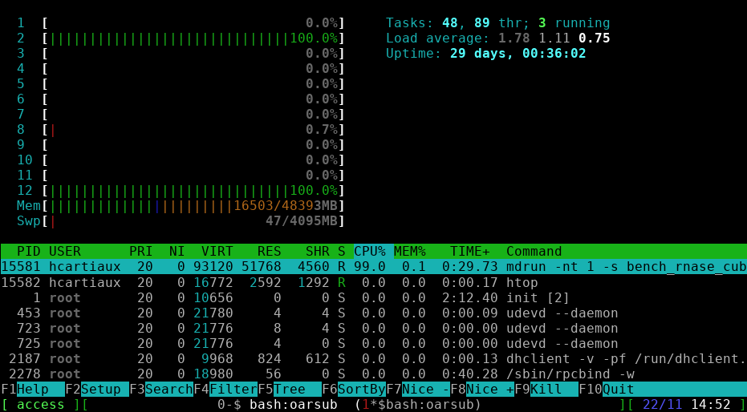
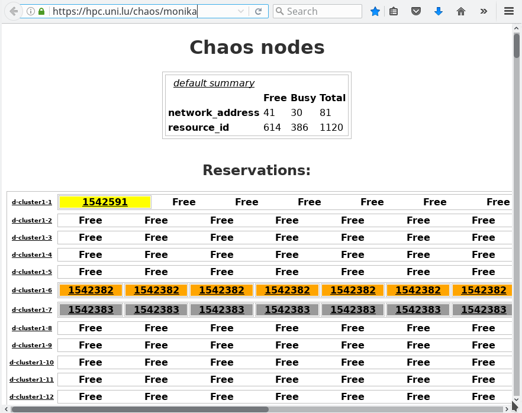
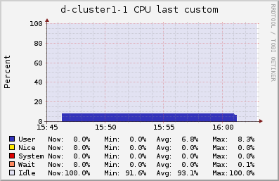
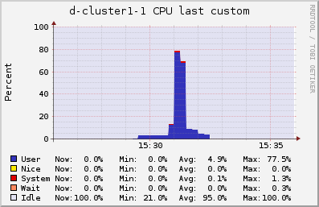

HPC workflow with sequential jobs
=================================

# Prerequisites

Make sure you have followed the tutorial "Getting started".

# Intro

For many users, the typical usage of the HPC facilities is to execute 1 program with many parameters.
On your local machine, you can just start your program 100 times sequentially.
However, you will obtain better results if you parallelize the executions on a HPC Cluster.

During this session, we will see 3 use cases:

* Exercise 1: Use the serial launcher (1 node, in sequential and parallel mode);
* Exercise 2: Use the generic launcher, distribute your executions on several nodes (python script);
* Exercise 3: Advanced use case, using a Java program: "JCell".

We will use the following github repositories:

* [ULHPC/launcher-scripts](https://github.com/ULHPC/launcher-scripts)
* [ULHPC/tutorials](https://github.com/ULHPC/tutorials)

# Practical session 2

## Connect to the cluster access node, and set-up the environment for this tutorial

You can chose one of the 3 production cluster hosted by the University of Luxembourg.

For the next sections, note that you will use `Slurm` on Iris, and `OAR` on Chaos & Gaia.

    (yourmachine)$> ssh iris-cluster
    (yourmachine)$> ssh chaos-cluster
    (yourmachine)$> ssh gaia-cluster

If your network connection is unstable, use [screen](http://www.mechanicalkeys.com/files/os/notes/tm.html):

    (access)$> screen

We will work in [the home directory](https://hpc.uni.lu/users/docs/env.html#working-directories).

You can check the usage of your directories using the command `df-ulhpc` on Gaia

    (access)$> df-ulhpc
    Directory                         Used  Soft quota  Hard quota  Grace period
    ---------                         ----  ----------  ----------  ------------
    /home/users/hcartiaux             3.2G  100G        -           none
    /work/users/hcartiaux             39M   3.0T        -           none

Note that the user directories are not yet all available on Iris, and that the quota are not yet enabled.

Create a sub directory $HOME/PS2, and work inside it

    (access)$> mkdir $HOME/PS2
    (access)$> cd $HOME/PS2

In the following parts, we will assume that you are working in this directory.

Clone the repositories `ULHPC/tutorials` and `ULHPC/launcher-scripts.git`

    (access)$> git clone https://github.com/ULHPC/launcher-scripts.git
    (access)$> git clone https://github.com/ULHPC/tutorials.git

In order to edit files in your terminal, you are expected to use your preferred text editor:

* [nano](http://www.howtogeek.com/howto/42980/the-beginners-guide-to-nano-the-linux-command-line-text-editor/)
* [vim](http://vimdoc.sourceforge.net/htmldoc/usr_toc.html)
* [emacs](http://www.jesshamrick.com/2012/09/10/absolute-beginners-guide-to-emacs/)
* ...

If you have never used any of them, `nano` is intuitive, but vim and emacs are more powerful.

## Exercise 1: Parametric experiment with Gromacs

Gromacs is a popular molecular dynamics software.
In this exercise, we will process some example input files, and make the parameter `fourier_spacing` varies from 0.1 to 0.2 in increments of 0.005.

Create a file which contains the list of parameters:

    (access)$> seq 0.1 0.005 0.2 > $HOME/PS2/param_file

#### Step 1: Naive workflow

We will use the launcher `NAIVE_AKA_BAD_launcher_serial.sh` (full path: `$HOME/PS2/launcher-scripts/bash/serial/NAIVE_AKA_BAD_launcher_serial.sh`).

Edit the following variables:

* `MODULE_TO_LOAD` must contain the list of modules to load before executing `$TASK`,
* `TASK` must contain the path of the executable, 
* `ARG_TASK_FILE` must contain the path of your parameter file.

        (node)$> nano $HOME/PS2/launcher-scripts/bash/serial/NAIVE_AKA_BAD_launcher_serial.sh

            MODULE_TO_LOAD=(bio/GROMACS)
            TASK="$HOME/PS2/tutorials/basic/sequential_jobs/scripts/run_gromacs_sim.sh"
            ARG_TASK_FILE=$HOME/PS2/param_file

##### Step 1a: using OAR on Chaos & Gaia

Launch the job, in interactive mode and execute the launcher:

    (access)$> oarsub -I -l core=1

        [ADMISSION RULE] Set default walltime to 7200.
        [ADMISSION RULE] Modify resource description with type constraints
        OAR_JOB_ID=1542591
        Interactive mode : waiting...
        Starting...
        
        Connect to OAR job 1542591 via the node d-cluster1-1
        Linux d-cluster1-1 3.2.0-4-amd64 unknown
         14:27:19 up 29 days, 10 min,  1 user,  load average: 0.00, 0.00, 0.06
        [OAR] OAR_JOB_ID=1542591
        [OAR] Your nodes are:
              d-cluster1-1*1

    (node)$ $HOME/PS2/launcher-scripts/bash/serial/NAIVE_AKA_BAD_launcher_serial.sh

**Or** in passive mode (the output will be written in a file named `OAR.<JOBID>.stdout`)

    (access)$> oarsub -l core=1 $HOME/PS2/launcher-scripts/bash/serial/NAIVE_AKA_BAD_launcher_serial.sh

        [ADMISSION RULE] Set default walltime to 7200.
        [ADMISSION RULE] Modify resource description with type constraints
        OAR_JOB_ID=1542592

You can use the command `oarstat -f -j <JOBID>` to read all the details about your job:

    (access)$> oarstat -f -j 1542592
        Job_Id: 1542592
            project = default
            owner = hcartiaux
            state = Running
            wanted_resources = -l "{type = 'default'}/core=1,walltime=2:0:0" 
            assigned_resources = 434
            assigned_hostnames = d-cluster1-1
            queue = default
            command = /work/users/hcartiaux//PS2/launcher-scripts/bash/serial/NAIVE_AKA_BAD_launcher_serial.sh
            ...

In all cases, you can connect to a reserved node using the command `oarsub -C <JOBID>`
and check the status of the system using standard linux command (`free`, `top`, `htop`, etc)

    $ (access)$> oarsub -C 1542592
        Connect to OAR job 1542592 via the node d-cluster1-1
        Linux d-cluster1-1 3.2.0-4-amd64 unknown
         14:51:56 up 29 days, 35 min,  2 users,  load average: 1.57, 0.98, 0.70
        [OAR] OAR_JOB_ID=1542592
        [OAR] Your nodes are:
              d-cluster1-1*1
    
    0 14:51:57 hcartiaux@d-cluster1-1(chaos-cluster)[OAR1542592->119] ~ $ free -m
                 total       used       free     shared    buffers     cached
    Mem:         48393      41830       6563          0        204      25120
    -/+ buffers/cache:      16505      31888
    Swap:         4095         47       4048
    0 14:51:59 hcartiaux@d-cluster1-1(chaos-cluster)[OAR1542592->119] ~ $ htop

During the execution, you can try to locate your job on the [monika web interface](https://hpc.uni.lu/chaos/monika).

Using the [system monitoring tool ganglia](https://hpc.uni.lu/chaos/ganglia), check the activity on your node.

##### Step 1b: using Slurm on Iris

Launch the job, in interactive mode and execute the launcher:

    (access)$> srun -p interactive -N 1 --qos qos-interactive --pty bash -i

    (node)$ $HOME/PS2/launcher-scripts/bash/serial/NAIVE_AKA_BAD_launcher_serial.sh

**Or** in passive mode (the output will be written in a file named `BADSerial-<JOBID>.out`)

    (access)$> sbatch $HOME/PS2/launcher-scripts/bash/serial/NAIVE_AKA_BAD_launcher_serial.sh 

You can use the command `scontrol show job <JOBID>` to read all the details about your job:

    (access)$> scontrol show job 2124
    JobId=2124 JobName=BADSerial
       UserId=hcartiaux(5079) GroupId=clusterusers(666) MCS_label=N/A
       Priority=100 Nice=0 Account=ulhpc QOS=qos-batch
       JobState=RUNNING Reason=None Dependency=(null)
       Requeue=1 Restarts=0 BatchFlag=1 Reboot=0 ExitCode=0:0
       RunTime=00:04:58 TimeLimit=01:00:00 TimeMin=N/
       SubmitTime=2017-06-11T16:12:27 EligibleTime=2017-06-11T16:12:27
       StartTime=2017-06-11T16:12:28 EndTime=2017-06-11T17:12:28 Deadline=N/A

And the command `sacct` to see the start and end date

    (access)$> sacct --format=start,end --j 2125
                  Start                 End 
    ------------------- ------------------- 
    2017-06-11T16:23:23 2017-06-11T16:23:51 
    2017-06-11T16:23:23 2017-06-11T16:23:51

In all cases, you can connect to a reserved node using the command `srun`
and check the status of the system using standard linux command (`free`, `top`, `htop`, etc)

    (access)$> srun -p interactive --qos qos-interactive --jobid <JOBID> --pty bash

During the execution, you can see the job in the queue with the command `squeue`:

    (access)$> squeue 
             JOBID PARTITION     NAME     USER ST       TIME  NODES NODELIST(REASON)
              2124     batch BADSeria hcartiau  R       2:16      1 iris-053
              2122 interacti     bash svarrett  R       5:12      1 iris-081

Using the [system monitoring tool ganglia](https://hpc.uni.lu/iris/ganglia/), check the activity on your node.

#### Step 2: Optimal method using GNU parallel (GNU Parallel)

We will use the launcher `launcher_serial.sh` (full path: `$HOME/PS2/launcher-scripts/bash/serial/launcher_serial.sh`).

Edit the following variables:

    (access)$> nano $HOME/PS2/launcher-scripts/bash/serial/launcher_serial.sh

    MODULE_TO_LOAD=(bio/GROMACS)
    TASK="$HOME/PS2/tutorials/basic/sequential_jobs/scripts/run_gromacs_sim.sh"
    ARG_TASK_FILE=$HOME/PS2/param_file

Submit the (passive) job with `oarsub` if you are using Chaos or Gaia

    (access)$> oarsub -l nodes=1 $HOME/PS2/launcher-scripts/bash/serial/launcher_serial.sh

Or with `sbatch` if you are using Iris

    (access)$> sbatch $HOME/PS2/launcher-scripts/bash/serial/launcher_serial.sh

**Question**: compare and explain the execution time with both launchers:

* Naive workflow: time = **16m 32s**  
  

* Parallel workflow: time = **2m 11s**  
  

**/!\ Gaia and Chaos nodes are heterogeneous. In order to compare execution times, 
you must always use the same type of nodes (CPU/Memory), using [properties](https://hpc.uni.lu/users/docs/oar.html#select-nodes-precisely-with-properties)
in your `oarsub` command.**

## Exercise 2: Watermarking images in Python

We will use another program, `watermark.py` (full path: `$HOME/PS2/tutorials/basic/sequential_jobs/scripts/watermark.py`),
and we will distribute the computation on 2 nodes with the launcher `parallel_launcher.sh`
(full path: `$HOME/PS2/launcher-scripts/bash/generic/parallel_launcher.sh`).

This python script will apply a watermark to the images (using the Python Imaging library).

The command works like this:

    python watermark.py <path/to/watermark_image> <source_image>

We will work with 2 files:

* `copyright.png`: a transparent images, which can be applied as a watermark
* `images.tgz`: a compressed file, containing 30 JPG pictures (of the Gaia Cluster :) ).

#### Step 0: python image manipulation module installation

In an interactive job, install `pillow` in your home directory using this command:
    

    (access IRIS)>$ srun -p interactive -N 1 --qos qos-interactive --pty bash -i
    (access Chaos/Gaia)>$ oarsub -I 

    (node)>$ pip install --user pillow

#### Step 1: Prepare the input files

Copy the source files in your $HOME directory.

    (access)>$ tar xvf /mnt/isilon/projects/ulhpc-tutorials/sequential/images.tgz -C $HOME/PS2/
    (access)>$ cp /mnt/isilon/projects/ulhpc-tutorials/sequential/copyright.png $HOME/PS2

    (access)>$ cd $HOME/PS2

#### Step 2: Create a list of parameters

We must create a file containing a list of parameters, each line will be passed to `watermark.py`.

    ls -d -1 $HOME/PS2/images/*.JPG | awk -v watermark=$HOME/PS2/copyright.png '{print watermark " " $1}' > $HOME/PS2/generic_launcher_param
    \_____________________________/   \_________________________________________________________________/ \_________________________________/
                   1                                                    2                                                3

1. `ls -d -1`: list the images
2. `awk ...`: prefix each line with the first parameter (watermark file)
3. `>`: redirect the output to the file $HOME/generic_launcher_param

#### Step 3: Configure the launcher

We will use the launcher `parallel_launcher.sh` (full path: `$HOME/PS2/launcher-scripts/bash/generic/parallel_launcher.sh`).

Edit the following variables:
    

    (access)$> nano $HOME/PS2/launcher-scripts/bash/generic/parallel_launcher.sh

    TASK="$HOME/PS2/tutorials/basic/sequential_jobs/scripts/watermark.py"
    ARG_TASK_FILE="$HOME/PS2/generic_launcher_param"
    # number of cores needed for 1 task
    NB_CORE_PER_TASK=2

#### Step 4: Submit the job

We will spawn 1 process per 2 cores on 2 nodes

On Iris, the Slurm job submission command is `sbatch`

    (access IRIS)>$ sbatch $HOME/PS2/launcher-scripts/bash/generic/parallel_launcher.sh

On Chaos and Gaia, the OAR job submission command is `oarsub`

    (access Chaos/Gaia)>$ oarsub $HOME/PS2/launcher-scripts/bash/generic/parallel_launcher.sh

#### Step 5: Download the files

On your laptop, transfer the files in the current directory and look at them with your favorite viewer.
Use one of these commands according to the cluster you have used:

    (yourmachine)$> rsync -avz chaos-cluster:/home/users/<LOGIN>/PS2/images .
    (yourmachine)$> rsync -avz gaia-cluster:/home/users/<LOGIN>/PS2/images .
    (yourmachine)$> rsync -avz iris-cluster:/home/users/<LOGIN>/PS2/images .

**Question**: which nodes are you using, identify your nodes with the command `oarstat -f -j <JOBID>` or Monika
([Chaos](https://hpc.uni.lu/chaos/monika), [Gaia](https://hpc.uni.lu/gaia/monika))

## Exercise 3: Advanced use case, using a Java program: "JCell"

Let's use [JCell](https://jcell.gforge.uni.lu/), a framework for working with genetic algorithms, programmed in Java.

We will use 3 scripts:

* `jcell_config_gen.sh` (full path: `$HOME/PS2/tutorials/basic/sequential_jobs/scripts/jcell_config_gen.sh`)

We want to execute Jcell, and change the parameters MutationProb and CrossoverProb.
This script will install JCell, generate a tarball containing all the configuration files,
and the list of parameters to be given to the launcher.

* `jcell_wrapper.sh` (full path: `$HOME/PS2/tutorials/basic/sequential_jobs/scripts/jcell_wrapper.sh`)

This script is a wrapper, and will start one execution of jcell with the configuration file given in parameter.
If a result already exists, then the execution will be skipped.
Thanks to this simple test, our workflow is fault tolerant, 
if the job is interrupted and restarted, only the missing results will be computed.

* `parallel_launcher.sh` (full path: `$HOME/PS2/launcher-scripts/bash/generic/parallel_launcher.sh`)

This script will drive the experiment, start and balance the java processes on all the reserved resources.

#### Step 1: Generate the configuration files:

Execute this script:

        (access)$> $HOME/PS2/tutorials/basic/sequential_jobs/scripts/jcell_config_gen.sh

This script will generate the following files in `$HOME/PS2/jcell`:
  
  * `config.tgz`
  * `jcell_param`

#### Step 2: Edit the launcher configuration, in the file `$HOME/PS2/launcher-scripts/bash/generic/parallel_launcher.sh`.

This application is cpu-bound and not memory-bound, so we can set the value of `NB_CORE_PER_TASK` to 1.
Using these parameters, the launcher will spaw one java process per core on all the reserved nodes.

        (access)$> nano $HOME/PS2/launcher-scripts/bash/generic/parallel_launcher.sh

        TASK="$HOME/PS2/tutorials/basic/sequential_jobs/scripts/jcell_wrapper.sh"
        ARG_TASK_FILE="$HOME/PS2/jcell/jcell_param"
        # number of cores needed for 1 task
        NB_CORE_PER_TASK=1

#### Step 3: Submit the job

On Iris, the Slurm job submission command is `sbatch`

    (access IRIS)>$ sbatch $HOME/PS2/launcher-scripts/bash/generic/parallel_launcher.sh

On Chaos and Gaia, the OAR job submission command is `oarsub`

    (access Chaos/Gaia)>$ oarsub $HOME/PS2/launcher-scripts/bash/generic/parallel_launcher.sh 

#### Step 4. Retrieve the results on your laptop:

Use one of these commands according to the cluster you have used:

        (yourmachine)$> rsync -avz chaos-cluster:/home/users/<LOGIN>/PS2/jcell/results .
        (yourmachine)$> rsync -avz gaia-cluster:/home/users/<LOGIN>/PS2/jcell/results .
        (yourmachine)$> rsync -avz iris-cluster:/home/users/<LOGIN>/PS2/jcell/results .

**Question**: check the system load and memory usage with Ganglia
([Chaos](https://hpc.uni.lu/chaos/ganglia), [Gaia](https://hpc.uni.lu/gaia/ganglia))

## At the end, please clean up your home and work directories :)

**Please** do not store unnecessary files on the cluster's storage servers:

    (access)$> rm -rf $HOME/PS2

# Going further:

* [Checkpoint / restart with BLCR](http://hpc.uni.lu/users/docs/oar.html#checkpointing)
* [OAR array jobs (fr)](http://crimson.oca.eu/spip.php?article157)

